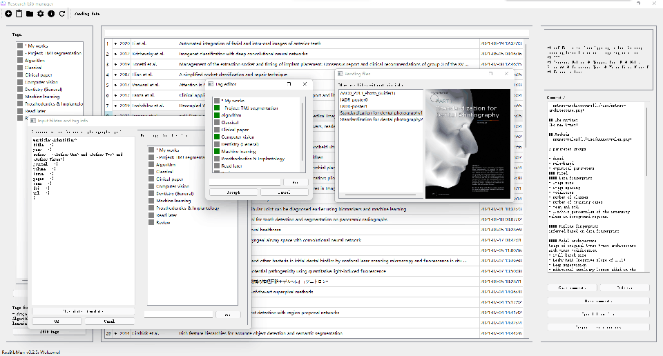
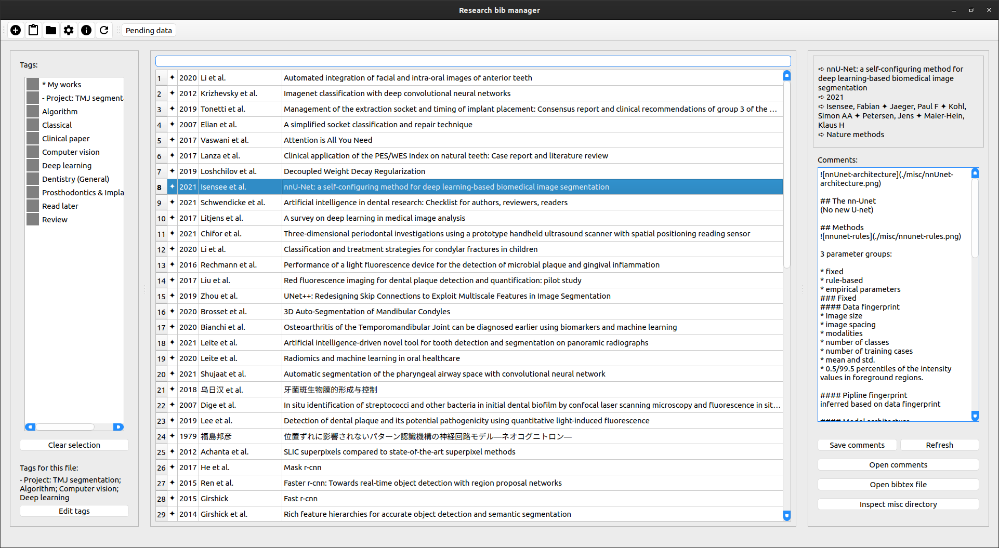

# Resbibman 
Resbibman: a **Res**earch **bib**liograpy **man**ager

<!---->
<!---->

A research literature manager that utilize Bibtex file to record paper information, 
it relies on tags to differentiate papers, and use markdown for notes.

It also has server modules: resbibman-server (RBM server) with a web viewer (RBMWeb) so that it can be deployed onto a server to share literatures or work in online mode.

**Table of content**
<!-- START doctoc generated TOC please keep comment here to allow auto update -->
<!-- DON'T EDIT THIS SECTION, INSTEAD RE-RUN doctoc TO UPDATE -->
- [Resbibman](#resbibman)
  - [Features](#features)
- [Installation \& Usage](#installation--usage)
  - [Usage:](#usage)
    - [Configure](#configure)
- [Manuals and documentations](#manuals-and-documentations)
  - [Known issues](#known-issues)

<!-- END doctoc generated TOC please keep comment here to allow auto update -->


## Features
* Host a server to view, share and discuss online
* Cross-platform
* Cascading tags  
* Markdown notes, with LaTeX equation support
* Multi-user permission management
* AI-powered features (iRBM)
<!-- * Online mode (remote storage) -->

# Installation & Usage
Installation refer to - [Getting Started](resbibman/docs/gettingStarted.md##server-startup)

<!-- ### Docker deployment <span style="color:red">[outdated]</span>
<span style="color:blue">To be revised...</span>   
Instead of manual installation, The the RBMWeb server can be deployed via docker,   

You need to edit `docker-compose.yml` to change port and mount point mapping, then execute the following commands to start:
```bash
# update docker container if it's not been built
docker-compose build
# run
docker-compose up
```
To manage access key (for usage see: `rbm-keyman -h`):
```bash
docker exec resbibman rbm-keyman ...
``` -->

## Usage:
**To start the RBM and RBMWeb servers:**
```bash
resbibman server
```
The RBM and RBMWeb are Tornado servers,   
- RBM provides API for the client (GUI & WebUI & CLI) to communicate with.
- RBMWeb is a Web-UI frontend server.

**To start the iRBM server:**
```bash
resbibman iserver
```
The iRBM server is written with FastAPI, it provides additional AI features and is designed to be connected by the RBM server, so that the latter can provide AI features to the client.  

> <details> 
> <summary>The reason to separate iRBM server from RBM server</summary>  
> - AI features may require more resources, so that the iserver can be deployed on a more powerful machine. If the user does not need AI features, there is no need to start the iserver and install the heavy AI dependencies.  <br>
> - Allocating resources to the iserver and RBM server separately can be more flexible. For example, the iserver may need more GPU memory, we can launch multiple RBM servers pointing to different `$RBM_HOME`, while sharing the same iserver. <br>
> -  It is also possible that the iserver needs a proxy to access the internet, while the RBM server does not.   
</details>

For CLI help, see `resbibman -h`  

For detailed server settings, please refer to [Getting Started](resbibman/docs/gettingStarted.md)

### Configure
`$RBM_HOME` directory is used for application data storage, by default it is set to `~/.RBM`.  
The data directory contains the configuration file, log files, default database, RBMWeb backend data, cache files...  

To start the application with arbitrary data directory, you can run: 
```bash
RBM_HOME="your/path/here" resbibman ...
```

Other management tools include: 

```bash
rbm-keyman      # Manage access key
rbm-discuss     # Manage online discussions
rbm-collect     # Automatic add entry to database with retriving string
rbm-resetconf   # To reset default configuration
rbm-share       # To generate share url
rbm-index       # To build and query feature of the database, for fuzzy search
rbm-utils       # Miscellaneous utilities
```

# Manuals and documentations
- [api-usage](resbibman/docs/api.md)
- [development](resbibman/docs/devGuide.md)

## Known issues

<!-- * May crash when changing selection (caused by auto saving) -->
* Markdown horizontal line highlighter not working somehow
* Adding file may encounter permission error for FAT32 format destination in Linux machine (refer to: [stackoverflow-25716333](https://stackoverflow.com/questions/25716333/))
* Add data without tag permission on non-admin account, then delete local will raise exception
* Full-screen GUI in macOS may somehow crash
* ~~QWebEngineView may not show html(not work on opensuse and ubuntu22.04?)~~(Resolved with PyQt6)
* ~~PDFReader based on QWebEngineView may not show PDF (For PyQt6 under Windows, refer to: [stachoverflow-73350761](https://stackoverflow.com/questions/73350761/))~~(Resolved using PDF.js)

<!-- ## Credits:
https://github.com/google/material-design-icons   
https://mozilla.github.io/pdf.js/   -->
<!-- https://github.com/MathJax/MathJax   -->
