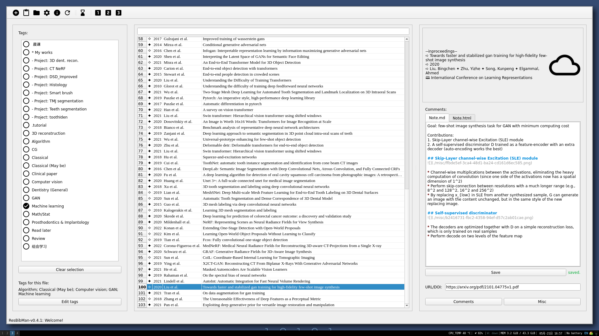

# Resbibman 
Resbibman: a **Res**earch **bib**liograpy **man**ager

<!---->
<!---->

A research literature manager that utilize Bibtex file to record paper information, 
it relies on tags to differentiate papers, and use markdown for notes.

It also has server-side module (RBM-web) with a web viewer so that it can be deployed onto a server to share literatures or work in online mode.

[comment]: <> (## distribution)

[comment]: <> (`python setup.py bdist_wheel --universal`)

## Features
* Cross-platform
* Cascading tags  
* Markdown notes, with LaTeX equation support
* Online mode (remote storage)
* Host a server to view, share and discuss online
* Multi-user permission management
<!--* Various file formats support, including webpage-->

# Installation & Usage

~~Refer to the [docs-CN](./resbibman/docs/UserGuide.md) for the usage of this software.~~

## Installation

installation for client-side GUI only:
```bash
pip install setuptools wheel pyyaml
pip install packages/QFlowLayout packages/QCollapsibleCheckList
pip install .
rbm-utils download_pdfjs                # [optional] download pdf.js viewer to view pdf inside resbibman

# pip install ".[ai]"                   # [optional] to install with AI dependencies
```

installation for server and development
```bash
tsc
cd RBMWeb2 && npm install && npm run build && cd ..
pip install setuptools wheel pyyaml
pip install -e ".[full]"
```

### Docker deployment <span style="color:red">[outdated]</span>
<span style="color:blue">To be revised...</span>   
Instead of manual installation, The the RBMWeb server can be deployed via docker,   

You need to edit `docker-compose.yml` to change port and mount point mapping, then execute the following commands to start:
```bash
# update docker container if it's not been built
docker-compose build
# run
docker-compose up
```
To manage access key (for usage see: `rbm-keyman -h`):
```bash
docker exec resbibman rbm-keyman ...
```

## Usage:
To start the client GUI program:
```bash
resbibman client
```
To start the RBMWeb server:
```bash
resbibman server
```
To start the iRBM server:
```bash
resbibman iserver
```

For CLI help, see `resbibman -h`  


### Configure
`$RBM_HOME` directory is used for application data storage, by default it is set to `~/.RBM`.  
The data directory contains the configuration file, log files, default database, RBMWeb backend data, cache files...  

To start the application with arbitrary data directory, you can run: 
```bash
RBM_HOME="your/path/here" resbibman
```

Other management tools include: 

```bash
rbm-keyman      # Manage access key
rbm-discuss     # Manage online discussions
rbm-collect     # Automatic add entry to database with retriving string
rbm-resetconf   # To reset default configuration
rbm-utils       # Miscellaneous utilities
rbm-share       # To generate share url
rbm-index       # To build and query feature of the database, for fuzzy search
```

# Future works

<details>
<summary> Future works</summary>

## Todo list

- [x] To use TableView of the selection panel
- [x] PDF cover preview
- [x] Change bib
- [x] Use cache to accelerate pdf preview
- [x] Better way to define time-modified
- [x] Online discussion / View comments online (Use sqlite to save discussion on server side)
- [x] Markdown LaTeX equation support
- [x] Export database
- [x] Better font size
- [x] Other citation format convert to bibtex
- [x] Key-user relation, mandatory tags
- [x] Server search
- [ ] Related works
- [ ] Reading time
- [ ] Dashboard page
- [ ] Within software cross-reference
- [ ] Redirect some logging to status bar
- [ ] Pdf compression - [reference?](https://blog.csdn.net/xinRCNN/article/details/113273463)
- [ ] ~~ User info, associate each user with a key in rbm-keyman ~~

In query widget while importing articles:  

- [x] Add copy from template button
- [x] Other bibtex template
- [x] Other format convert to bibtex
- [ ] Format check

In file selector:

- [x] Add search bar
- [x] Multiple selection
- [x] Right click: export, export bib, delete
- [x] Right click: open url, free local

Main window:
- [x] Refresh button

settings:

Tags:
- [x] Right click: rename; delete;
- [x] Sub-tags (Cascading tags / Nested tags)

Refractor:
- [ ] Move more methods into core classes

rbm-collect:
- [ ] web
- [ ] medRxiv
- [ ] bioRxiv
- [ ] PMID

### Long time goals

- [ ] Relation graph
- [ ] ~~Language support~~

<!-- ## Ideas: -->
<!-- QRunnable for multithreading -->
<!--  -->

</details>

## Known issues

<!-- * May crash when changing selection (caused by auto saving) -->
* Markdown horizontal line highlighter not working somehow
* Adding file may encounter permission error for FAT32 format destination in Linux machine (refer to: [stackoverflow-25716333](https://stackoverflow.com/questions/25716333/))
* Add data without tag permission on non-admin account, then delete local will raise exception
* ~~QWebEngineView may not show html(not work on opensuse and ubuntu22.04?)~~(Resolved with PyQt6)
* ~~PDFReader based on QWebEngineView may not show PDF (For PyQt6 under Windows, refer to: [stachoverflow-73350761](https://stackoverflow.com/questions/73350761/))~~(Resolved using PDF.js)

## Credits:
https://github.com/google/material-design-icons   
https://github.com/GTRONICK/QSS  
https://github.com/MathJax/MathJax  
https://mozilla.github.io/pdf.js/  
