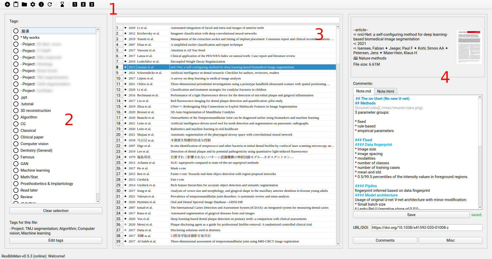
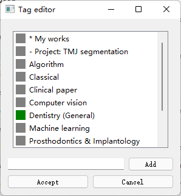
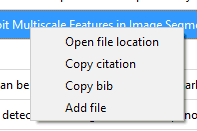
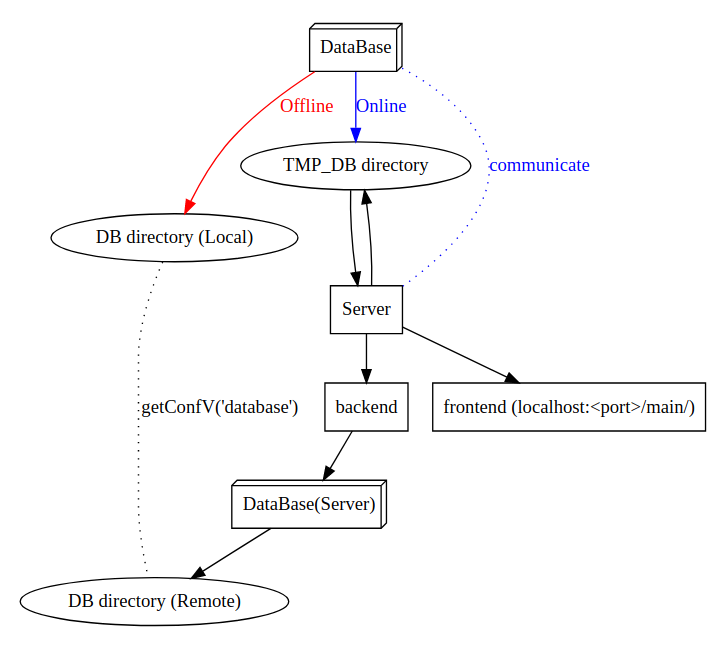

# 使用说明

软件版本：0.5.3

## 概述

Lires (Research bibliography manager, lires) 软件为一款轻量级文献储存和管理软件，该软件依赖Bibtex文件进行文献信息管理，以Markdown作为阅读笔记形式，利用不同的标签（tag）对文献类型进行区分。  
LiresWeb为lires软件的网络应用，可以提供文献分享、在线同步、在线阅读等网络服务。

（注：1. 本文档中文献/文档指同一内容；2. 当前显示文档指当前文档选择模块中显示的文档；3. 选中文档指当前文档中被选中的文献）

## 目录

[TOC]

## 软件安装

该软件使用Python开发，使用setuptools进行分发，使用需要安装Python（>=3.8）运行环境，支持平台包括：Windows, MacOS, Linux。

软件安装步骤如下：
进入安装目录，打开命令行（Windows10下为：shift+鼠标右键呼出交互菜单，选择“在此打开PowerShell”），依次输入：
```bash
pip install .
rbm-resetconf
```
至此安装完成。

### 可选安装

本软件使用Markdown语言作为文献阅读笔记文件形式，建议使用者自行下载支持Markdown语言的文本编辑器以获得更好的使用体验。


## 软件启动
使用软件时，进入命令行，输入`lires`打开客户端软件，命令行可选参数可见`resbibman -h`，常用参数：
```bash
lires                  # 启动客户端
lires -S               # 启动服务端 (LiresWeb)
lires -v               # 查看版本和更新日志
lires -c               # 清理临时文件夹缓存
lires -L DEBUG         # 软件运行过程中输出debug信息
lires --reset_conf     # 重置配置文件
```

## 界面

### 主界面



主界面可以被分为四大块，分别为：

1. 工具栏：包含本软件使用的主要工具；
2. 标签模块：集成标签相关功能，包括通过标签对文档进行筛选，对当前选中文档的标签进行修改等；
3. 文档选择模块：在此处进行文件的选择和搜索；
4. 文档信息模块：该模块展示文档的信息，在此处可以对单个文档进行笔记记录和其他操作；

下文将对四大模块和其主要功能进行介绍。


### 工具栏

工具栏外观：

从左至右，工具栏依次包含了以下功能：

1. 添加文献：打开文档选择窗口，选择文件并输入文献信息以完成导入。
若在文档选择窗口点击取消则仍可以进入文献输入界面，此时输入文献信息可以生成无文件的文档；
若选择文件后在文献输入界面点击取消，则文件会被存于暂存区；
2. 从剪切板中导入：从剪切板中的Bibtex格式字符串导入文档信息；
3. 打开数据库：打开数据库文件夹；
4. 设置：打开设置窗口，设置数据库路径、在线服务器地址、排序依据、表头信息、软件外观等；
5. 帮助：打开本使用说明；
6. 刷新/同步：重新载入全部数据库资料，若为在线模式则会同步数据库；
7. 等候区：打开等候窗口，等候窗口存放没有文献信息的文件，可用于之后补充文献信息；
8. 【1、2、3】分别代表界面图中的工具栏三个主要模块，点击可以开启/关闭模块显示以控制界面状态。


### 标签模块

标签模块展示了所有文献的标签，通过左键点击标签框中的标签以进行勾选对文档选择模块中显示的文献内容进行筛选。
右键点击任意标签可以呼出交互菜单，点击交互菜单中的“Rename tag”可以修改选定标签的名字，将改变资料库中所有文档的此标签名字（若为在线模式则也会修改服务端数据库中标签）；点击交互菜单中的“Delete tag”删除选定标签，将删除资料库中所有文档的此标签（若为在线模式则也会删除服务端数据库标签）。
点击“Clear selection”以快速清除标签选择框中的全部勾选。

​标签模块的底部显示了目前选中文档的标签，点击“Edit tags”将弹出标签编辑界面，可以修改目前选中文档的标签。

​		*标签模块中的交互菜单：*


​		*标签编辑界面：*



### 文档选择模块

​文档选择模块的上端输入框为搜索窗口，通过输入内容对当前文档进行筛选，筛选内容包括文献标题、年份、作者和文献阅读笔记，搜索内容支持[正则表达式](https://cn.bing.com/search?q=正则表达式)。

​文档选择模块的下部实际显示文档为数据库中所有文献依搜索内容及标签共同筛选的结果。当在设置中选择显示所有信息后，从左至右依次显示五列数据，分别为：文档状态、文献发表年、作者、文献名、最近修改时间，其中文档状态为实心时表示该文献存在附件，为空心时表示该条目仅有文献信息，无实际附件。


​双击文档可以使用系统阅读软件打开文献（在线模式若本地没有数据则将会现将该项同步至本地）。左键选中文档后（按住"Ctrl"可多选）按“Del”键可以从资料库中删除选中文档。选中文档后，按右键呼出交互菜单，点击交互菜单“Open file location”在系统文件浏览器中打开文件所在位置，点击交互菜单“Copy citation”将引文复制到系统剪切板，点击交互菜单“Copy bib”将引文以Bibtex格式复制到系统剪切板，点击交互菜单“Add file”可为无文件（仅有文献信息的）文档（)添加文件。

​		*文档选择模块中的交互菜单：*



### 文档信息模块

​文档信息模块上部显示了文献信息，包括标题、发表年份、作者、发表期刊等。模块中部为文档阅读笔记区。文档信息模块下部为操作区，包括数个按钮，其中：点击“Save”保存目前该模块中文档阅读笔记；点击“Open comments”使用系统软件打开阅读笔记；点击“Misc”查看文档内存放额外文件的文件夹，建议将文档额外附件和笔记使用的图片等文件存放于此处。  

文档阅读笔记区使用Markdown记录，支持简单的语法高亮，可以使用拖拽或者复制粘贴的方式添加图片。点击”Note.html“将以网页渲染模式显示笔记。

## 服务端使用
服务端启动前需要录入可用密码，密码管理使用`rbm-keyman`，命令行参数可见`rbm-keyman -h`  

服务端将设置中的数据库路径作为服务端数据库，默认端口为8080，网页端文献分享地址为`localhost:8080/main/`，网页端仅能查看数据库文献

启动服务端后，可以使用客户端以在线模式接入，在线模式下同步数据将被保存于临时数据库文件夹中，重启计算机后需从新同步下载，删除缓存将删除临时文件夹。
  

咨询、维护： [李梦寻](mailto:mengxunli@whu.edu.cn?subject=Lires_consult)

[comment]: <> (以下之后再改)
<!--
## 使用场景

​		本节以常用的使用场景为线索，介绍本软件的使用。

### 设置数据库路径

​		Lires软件数据库本质为系统文件夹，通过指定文件夹可以更换数据库，数据库切换方法为：工具栏->设置->Database path。数据库的设置可以促进不同使用人员间文档交流，通过将数据库设置为云盘路径可以实现不同设备间数据云同步。

### 导入文献

​		目前支持的原始文件类型为pdf和caj，导入文献的方法总体有三种类型：

1. **导入文件同时输入文献信息**
   此项通常为最常用的导入方法，有两种方式：

   1. 将文件直接拖入文档选择模块，此时会弹出文档信息输入界面，界面左侧输入栏可以输入bibtex格式文献信息，点击"Use bibtex template"将在输入栏中插入bibtex模板以手动输入信息（如下图），右侧为标签编辑栏，其使用同标签编辑模块中的标签编辑界面。完成信息输入后点击“OK”将会将文件剪切至数据库。
   2. 点击工具栏->添加文档，将弹出系统文件选择界面，选择相应文件后，弹出信息输入界面以输入文献信息。
   
   *文档信息输入界面：*
   
   
   
2. **仅导入文献信息而不提供文件**

   当不能获得原始文件时，也可以使用bibtex数据仅导入文献信息：首先需要将bibtex信息拷贝至系统剪切板，后点击工具栏->从剪切板中导入（快捷键：Ctrl+Shift+Alt+I）。后期若需要添加文献信息可通过右击文件选择模块相关条目，在交互菜单中“Add file”添加文件。

3. **导入文件暂存而暂不输入文献信息**

   当暂时无法获得文献信息时，可以将文献文件暂时放入暂存区，后期添加文献信息，有以下两种方法：

   1. 将文件直接拖入文档选择模块，此时会弹出文档信息输入界面，直接点击取消，此时文件将被存入暂存区，暂存区界面如下图，左侧显示了暂存区文件，右侧显示了目前选中文件首页预览。
   2. 点击工具栏->“Pending data”按钮，打开暂存区界面，直接将文件拖入暂存区左侧的暂存文件选择区，文件将被存入暂存区。

   *暂存区界面：*

   

   ​		在暂存区中右击文件可呼出交互菜单，点击“Add information”（快捷键为空格）将呼出文档信息输入界面，输入文档信息后文件将被移至主数据库；点击“Rename”（快捷键为F2）可对文件进行重命名；点击“Delete”（快捷键为Del）将删除该文件。

   *暂存区交互菜单：*

   


### 文献笔记

​		阅读文献时对于文献文件本身的修改可以通过系统pdf或caj阅读软件实现。主界面中的文档信息模块中部输入框显示了文本格式的Markdown笔记，可以直接在此处对笔记进行快速修改（修改完毕后需点击“Save comments”按钮保存修改，否则切换至其他文件后修改将会丢失），当需要专注编辑笔记或需要渲染Markdown语言时可以点击“Open comments”使用系统软件打开笔记。

### 文献引用

* 简单引用：在主界面的文档选择模块中右击可以呼出交互菜单，点击其中“Copy citation”选项会将文件的引文拷贝至系统剪切板，可以作为简单引文使用；

* LateX：当使用LaTeX语言撰写文章时，可以点击文档选择模块交互菜单中的“Copy bib”选项，复制Bibtex格式文献信息至系统剪切板，以此种方式制作所需要的Bibtex引文目录；

* Word：目前本软件尚未支持Word引文插入，可以使用支持Bibtex的第三方软件或插件——如[Zotero](https://www.zotero.org)：以Bibtex格式将引文信息[导入Zotero软件](https://www.zotero.org/support/kb/importing_standardized_formats)，使用其提供的Word插件进行文献引用。（更多将Bibtex文献插入word的方法可见：[How can I use my BibTeX library in MS Word?](https://interfacegroup.ch/how-can-i-use-my-bibtex-library-in-ms-word/)）


## 高级

### 文件储存形式


### 命令行参数


### 使用技巧

* 标签命名
* 额外附件

## 其他

作者：李梦寻  
维护联系、技术支持：李梦寻 （mengxunli@whu.edu.cn）
-->


