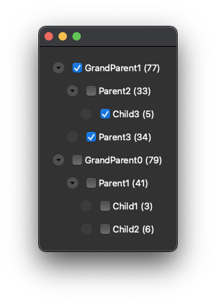
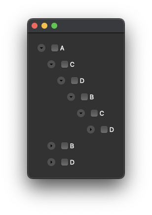

# QCollapsibleCheckList

A collapsible check list implemented with PyQt6
it supports cyclic/acyclic, nested/unnested data




<!--


-->


## Usage
```python
from QCollapsibleCheckList import CollapsibleCheckList, DataItemAbstract

# Implement your own data class inherit from DataItemAbstract
class <YOURCLASS>(DataItemAbstract):

    # Determine hierarchy of the data by implement a comparison method
    def isParentOf(self, data: <YOURCLASS>) -> bool:
        ...
    
    # Data shown on the widget as text
    def toString(self, data: <YOURCLASS>) -> str:
        ...

init_data: List[<YOURCLASS>]
widget = CollapsibleCheckList[<YOURCLASS>](init_items = init_data)
widget.show()

```

Avaliable entries
```python

class CollapsibleCheckList(Generic[DataItemT]):
    def addItem(self, i: DataItemT, check_status: bool = False):...
    def removeItem(self, i: DataItemT):...
    def isItemChecked(self, a: Union[DataItemT], int) -> bool:...
    def setItemChecked(self, data: DataItemT, status: bool):
    def setCollapse(self, item: DataItemT, status: bool):...
    @property
    def item_hover(self) -> Optional[DataItemT]:...
    @property
    def items_all(self) -> List[DataItemT]:...
    @property
    def items_checked(self) -> List[DataItemT]:...
    @property
    def items_unchecked(self) -> List[DataItemT]:...
```

For avaliable signals and more examples refer to `demo.demo-*`
