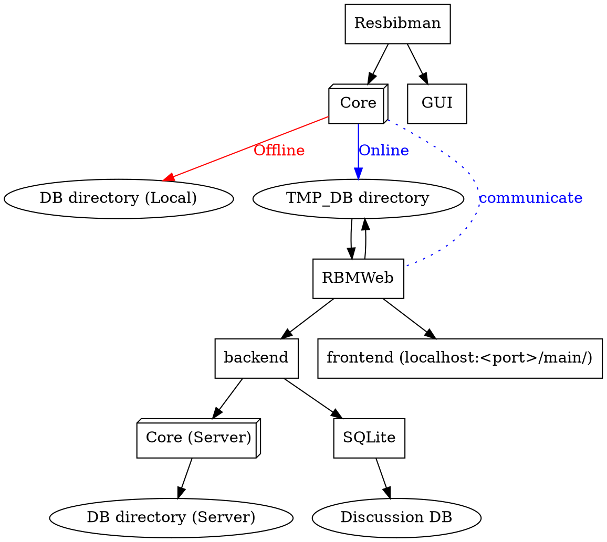

# File Structures
每个文件夹中应包含如下文件：
* <文件夹\>file：额外文件，例如markdown使用图像等
* file@-filename-：文献
* bib@-filename-.bib：bibtex文件
* comments@-filename-.md：批注
* info@-filename-.json：信息

info file 包含：
* device_import：导入设备
* time_import: 文献导入时间
* version_import: 导入时软件版本
* device_modify：上次修改设备
* time_modify: 上次修改时间(float)
* version_modify: 上次修改时软件版本
* tags：标签
* uuid: 文件识别码
* url: 链接（不为空且该文件没有文档（如pdf）时，可替代文档在线打开）

# Conventions
### Naming:
* snake\_case for object instance
* lowerCamelCase for function and filename
* UpperCamelCase (Pascal case) for class

# Core Structures
## Data system


## File system



# PyInstaller spec使用

```python
data_path = [
    ("resbibman/conf.json", "./resbibman/"),
    ("resbibman/backend/*.bib", "./backend/"),
    ("resbibman/stylesheets/*", "./resbibman/stylesheets/"),
    ("resbibman/icons/*", "./resbibman/icons/"),
    ("resbibman/docs/*", "./resbibman/docs/"),
    ("resbibman/assets/*", "./resbibman/assets/")
]

```
...
